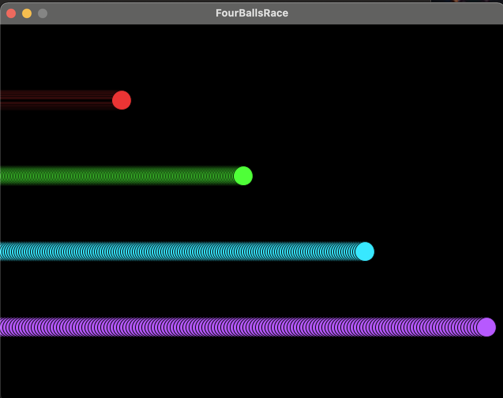

## The Race of Four Bouncing Balls !

### Problem Statement:
Four Balls move from **left to right**

* **Ball 1** is at **1/5th** height from the top of the window, moving with the speed **1 units** per frame
* **Ball 2** is at **2/5th** height from the top of the window, moving with the speed **2 units** per frame
* **Ball 3** is at **3/5th** height from the top of the window, moving with the speed **3 units** per frame
* **Ball 4** is at **4/5th** height from the top of the window, moving with the speed **4 units** per frame

_________________________________________________

### Concepts implemented / Tools used:
* Procedural Programming
* Processing - creative coding
* Java
* Markdown
* Gradle
* Git
* Intellij ide

____________________________
##  ```Three! Two! One !```



___________________________

### Want to run the sketch for yourself?

STEPS:
1) `git clone` into the repo
2) Open intellij from the repo
3) Make sure the Java SDK is 1.8 or Java 8
4) Move into the src/main/java/BouncingBallRace.java
5) Press Control+Shift+R to run the sketch
6) Enjoy!

___________________________
